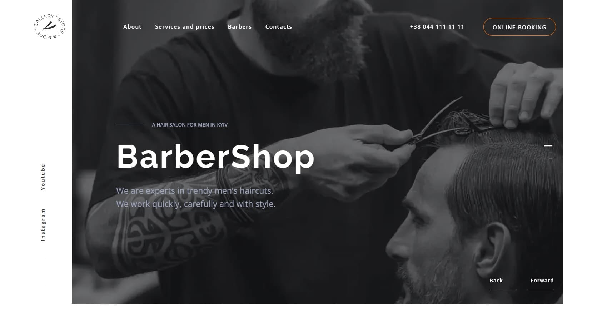
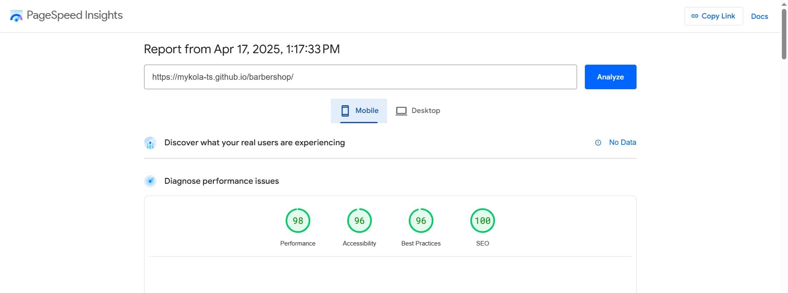
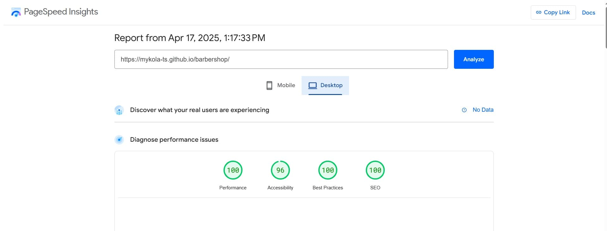

# 💈 BarberShop

BarberShop is a modern men’s hair salon in Kyiv. We offer stylish haircuts,
beard grooming, and high-quality service in a trendy atmosphere.


## 📑 Table of Contents

- [About the Project](#-about-the-project)

- [Website Structure](#-website-structure)

- [Useful Links](#-useful-links)

- [Technologies Used](#-technologies-used)

- [Libraries Used](#-libraries-used)

- [Folder and File Structure](#-folder-and-file-structure)

- [Features](#-features)

- [PageSpeed Results](#-pagespeed-results)

- [Installation & Setup](#-installation--setup)

- [Author](#-author)

## 📝 About the Project

This project is a responsive single-page website developed for the
**BarberShop** brand. It presents the services, style, and atmosphere of the
salon in a modern, user-friendly format.



### 🧩 Website Structure

The site consists of the following main sections:

- **Header** — includes a navigation menu, a prominent phone number, and an
  online booking button for easy access to appointments;
- **Hero** — an eye-catching section with a dynamic background image slider that
  includes the salon's name and a brief description;
- **About** — information about the philosophy and values of the barbershop;
- **Prices** — service pricing in a structured format;
- **Benefits** — reasons to choose this barbershop;
- **Barbers** — introduction of the team with photos and names;
- **Gallery** — images showing the interior and work;
- **Booking** — online appointment form with validation and confirmation modal;
- **Contacts** — location, contact information, and working hours;
- **Footer** — additional navigation and legal information.

## 🔗 Useful Links

[Live Demo](https://mykola-ts.github.io/barbershop/) — deployed version of the
website

[GitHub Repository](https://github.com/Mykola-Ts/barbershop) — deployed version
of the website

[Figma Design](https://www.figma.com/design/Y8K8PkHnfTXRIkZVdVhVfF/Barbershop-EN--Copy---Copy-?t=0bfgpMEvuiYvjqPZ-0)
— the project’s UI/UX design mockup

## 🛠 Technologies Used

- HTML5
- CSS3
- JavaScript (ES6+)
- Vite — modern frontend build tool

## 📦 Libraries Used

- [Swiper.js](https://swiperjs.com/) — responsive, touch-friendly sliders
- [JustValidate](https://just-validate.dev/) — form validation
- [lodash.throttle](https://lodash.com/docs/#throttle) — performance
  optimization for scroll events
- [modern-normalize](https://github.com/sindresorhus/modern-normalize) — CSS
  normalization
- [vite-plugin-full-reload](https://www.npmjs.com/package/vite-plugin-full-reload)
  — hot reload for Vite
- [vite-plugin-html-inject](https://www.npmjs.com/package/vite-plugin-html-inject)
  — inject HTML variables during build

## 📁 Folder and File Structure

- **.github/**: GitHub-specific configuration and workflows.

- **fonts/**: Custom fonts used in the project.

- **images/**: Folder for images and icons used throughout the site.

- **js/**: Contains JavaScript files for functionality.

- **partials/**: HTML partials for each section of the site.

- **public/**: Static assets for Vite (e.g., images, favicons, etc.).

- **styles/**: CSS files for each section of the site.

- **index.html**: The main HTML file for the site.

- **.editorconfig**: Editor configuration file.

- **.gitignore**: Specifies which files and directories to ignore in Git.

- **.prettierrc.json**: Prettier configuration for code formatting.

- **README.md**: Project documentation and setup instructions.

- **package.json**: Contains metadata about the project and dependencies.

- **vite.config.js**: Configuration file for Vite.

## 🎯 Features

- **Responsive Design**  
  Website adapts to different screen sizes: desktop, tablet, and mobile.

- **Mobile Menu**  
  Slide-in mobile navigation menu with backdrop and proper event handling. Menu
  automatically closes when clicking outside, on a nav-link, or on the close
  button.

- **Smooth Scrolling**  
  Navigation links smoothly scroll to the corresponding sections on the page for
  better user experience.

- **Online Booking Form**  
  Interactive form with input validation and a confirmation modal upon
  successful submission.

- **Feedback Modal**  
  After submitting the form, users receive a personalized confirmation message
  in a modal window with Escape and backdrop closing support.

- **Scroll to Top Button**  
  Appears when scrolling up or near the bottom of the page for quick navigation
  back to the top.

- **Swiper Slider Integration**  
  Image slider implemented using Swiper.js with adaptive behavior depending on
  the screen width.

- **Keyboard Accessibility**  
  Modal window and navigation elements are accessible via keyboard (e.g. Esc to
  close modals).

- **Clean & Modular Code**  
  Code is split into logical modules.

- **Lightweight & Fast**  
  Optimized for performance with lazy-loaded scripts and minimal CSS overhead.

## 🚀 PageSpeed Results

Google's PageSpeed Insights was used to analyze the performance of the
BarberShop website on both mobile and desktop devices. The results highlight
strong performance across various categories, ensuring a smooth user experience.

**📱 Mobile Performance:**



**💻 Desktop Performance:**



These results demonstrate that the website is optimized for both performance and
user experience, ensuring fast loading times and high usability on all devices.

## 🏗 Installation & Setup

To run the project locally, follow these steps:

1. **Clone the repository**
   ```bash
   git clone https://github.com/Mykola-Ts/barbershop.git
   cd barbershop
   ```
2. **Install dependencies**

   ```bash
    npm install
   ```

3. **Start the development server**

   ```bash
    npm run dev
   ```

4. **Open in browser**

Visit http://localhost:5173/ to view the project.

## 👨‍💻 Author

**Mykola Tsybulskyi**

🔗 GitHub https://github.com/Mykola-Ts

🔗 Email tsybulskiyk@gmail.com

🔗 LinkedIn https://www.linkedin.com/in/mykola-tsybulskyi
